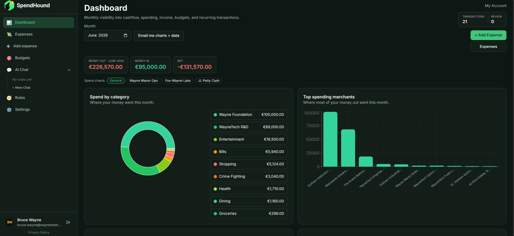
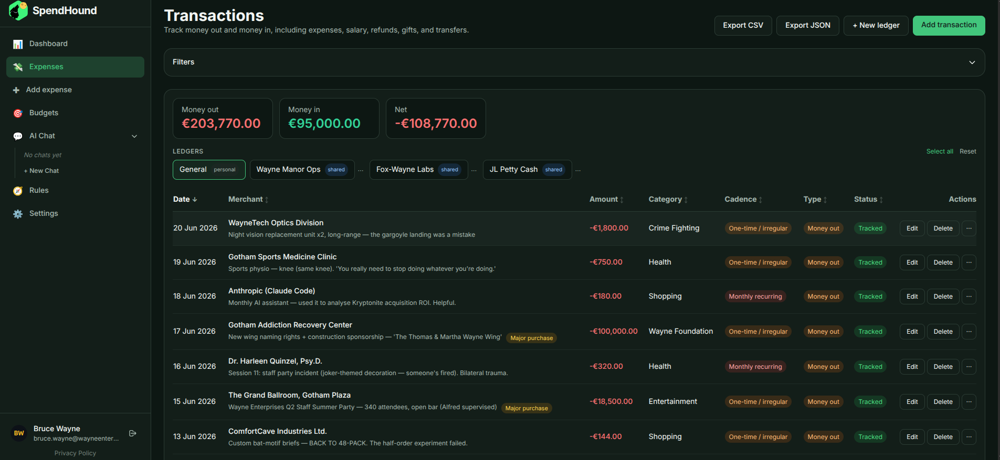
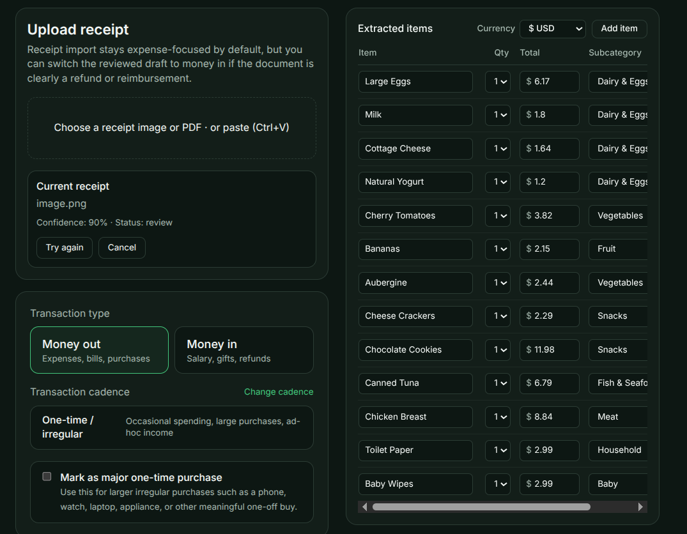
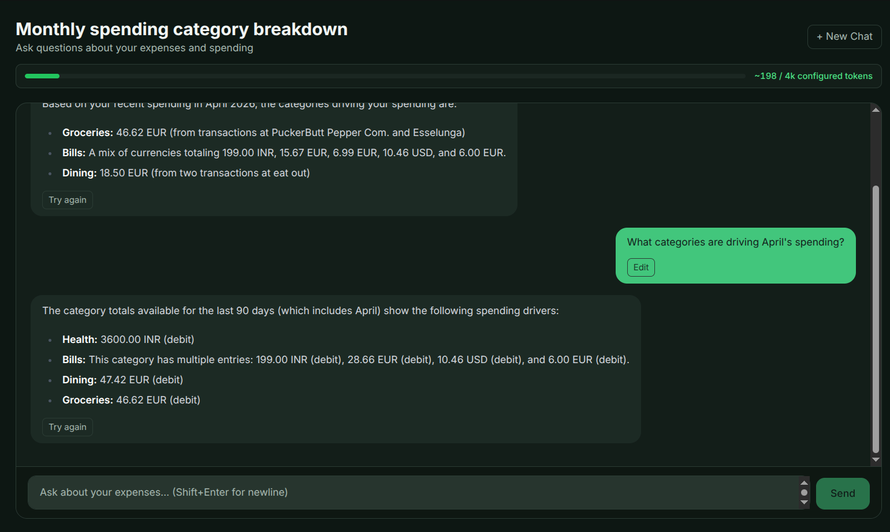
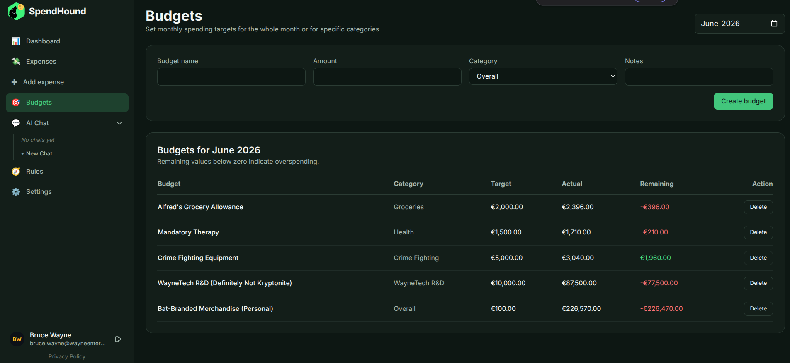
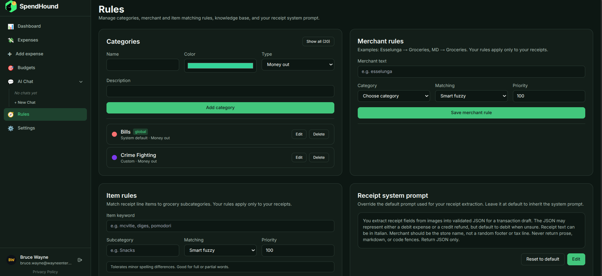

# SpendHound

SpendHound is a self-hosted, full-stack AI expense tracker with multimodal receipt parsing,
RAG-powered financial chat, multi-currency shared ledgers, recurring expense automation,
budget analytics, and automated monthly PDF reports. Optimized for Italian receipts; works
with any language.

Licensed under the [GNU Affero General Public License v3.0](LICENSE).

---

## Screenshots

> Or, try it live [here](https://spendhound.dodecahedrons.com).

| Dashboard | Expense list |
|---|---|
|  |  |

| Receipt extraction | AI chat |
|---|---|
|  |  |

| Budgets | Categories and rules |
|---|---|
|  |  |

---

## Features

- Google OAuth with admin approval gate
- Multimodal receipt upload: extracts merchant, amount, date, and line items via LLM; falls
  back through a 3-tier OCR stack (pdfplumber -> pdfminer -> pytesseract) for large files
- Bank statement PDF import with per-transaction confidence scores
- Manual expense entry with full edit support
- RAG semantic item classification using pgvector + Ollama embeddings with a user-correction
  learning loop
- Editable categories, merchant rules, and item keyword rules (global admin-wide + per-user)
- SSE-streaming financial chat grounded on 90 days of live expense data
- Multi-currency shared ledgers with role-based membership and full audit trail
- Recurring expenses (monthly, yearly, custom-interval, prepaid, one-time) with auto-generation
- Monthly dashboard analytics and budget-versus-actual tracking
- Review queue for low-confidence or uncategorized items
- CSV and JSON exports
- Automated monthly PDF report delivery via Puppeteer + Resend
- Admin approval panel with JWT-signed email-link tokens
- Pluggable LLM providers: Ollama (default, local, no API key required), Anthropic Claude,
  OpenAI, DeepSeek, Nebius, and any OpenAI-compatible endpoint (OpenRouter, Groq, Together AI,
  Mistral)
- Celery + Redis task queue: receipt extraction, statement parsing, and report delivery all
  run as durable background tasks that survive process restarts
- Full observability stack: Prometheus metrics + Alertmanager (Slack alerts) + Grafana
  dashboards + Loki log aggregation + Grafana Tempo distributed tracing (OpenTelemetry
  auto-instrumented: FastAPI, SQLAlchemy, HTTPX, Redis, Celery; manual LLM spans)
- Continuous Postgres backup via WAL-G to Cloudflare R2 (WAL archiving + daily base
  backup, 7-day retention, point-in-time recovery)
- PgBouncer connection pooling (session mode) between application and Postgres
- Demo mode: public Bruce Wayne account, automatically reset every 30 minutes via Celery Beat
- GDPR Article 17 compliance: full account erasure and selective data deletion endpoints

---

## Stack

| Layer | Technology |
|---|---|
| Backend | FastAPI 0.115 + Python 3.12 + SQLAlchemy 2.0 async + asyncpg |
| Task queue | Celery 5 + Redis 7 |
| Database | PostgreSQL 16 + pgvector extension |
| Migrations | Alembic (21 migration files, full up/down coverage) |
| Frontend | Next.js 14.2 App Router + NextAuth.js 4.24 + TailwindCSS + Recharts |
| Auth | Google OAuth 2.0 + HS256 JWT (python-jose) |
| LLM | Anthropic Claude, OpenAI, Ollama, DeepSeek, Nebius, OpenRouter, Groq, Together AI, Mistral |
| Embeddings | Ollama (768-dim) + pgvector |
| PDF generation | Puppeteer (headless Chromium via Next.js internal route) |
| Email | Resend API |
| Connection pooling | PgBouncer (session mode, scram-sha-256) |
| Observability | Prometheus + Alertmanager (Slack) + Grafana + Loki + Promtail + Tempo (OTel traces) + Flower (Celery monitor) + Sentry |
| Backup | WAL-G continuous backup to Cloudflare R2 (WAL archiving + daily base backup, 7-day retention, PITR) |
| Secrets | Infisical (CLI-injected at runtime; no .env files in source) |
| Containerization | Docker + Docker Compose |

---

## Prerequisites

| Tool | Minimum version | Notes |
|---|---|---|
| Docker + Compose v2 plugin | Docker 24+ | Required for Docker-based setup |
| Infisical CLI | any recent release | Required for the recommended dev/prod workflow |
| Python | 3.12+ | Local dev only (without Docker) |
| Node.js | 18+ | Local dev only (without Docker) |
| Ollama | any recent release | Optional -- local LLM; no API key needed |

Install Infisical CLI: https://infisical.com/docs/cli/overview

---

## Google OAuth setup

SpendHound requires a Google OAuth 2.0 client for sign-in.

1. Go to [console.cloud.google.com](https://console.cloud.google.com) > **APIs & Services** > **Credentials**
2. Create an **OAuth 2.0 Client ID** (type: Web application)
3. Add to **Authorised redirect URIs**:
   - `http://localhost:3000/api/auth/callback/google` (local dev, Docker or bare)
   - `https://yourdomain.com/api/auth/callback/google` (production)
4. Copy **Client ID** and **Client Secret**

---

## Quick start (Docker Compose + Infisical)

This is the recommended path. Infisical injects secrets at runtime so no secrets are ever
written to disk or committed to git.

### 1. Clone

```bash
git clone https://github.com/sumdher/spendhound.git
cd spendhound
```

### 2. Create an Infisical project and populate secrets

Sign up at https://infisical.com, create a project, and add the secrets listed in the
[Environment variables reference](#environment-variables-reference) below. Then log in once:

```bash
infisical login
```

### 3. Generate secrets locally (values to paste into Infisical)

```bash
# JWT signing key (backend)
python3 -c "import secrets; print(secrets.token_hex(32))"

# NextAuth secret (frontend)
python3 -c "import secrets; print(secrets.token_hex(32))"

# Fernet key for encrypting user LLM API keys at rest (optional but recommended)
python3 -c "from cryptography.fernet import Fernet; print(Fernet.generate_key().decode())"

# Shared secret for the internal Puppeteer PDF endpoint (required if monthly reports enabled)
python3 -c "import secrets; print(secrets.token_hex(32))"
```

### 4. Start the stack

```bash
make dev          # foreground (recommended for first run)
make dev-detach   # background
```

The `make dev` target runs:
```
infisical run --env dev --path / --recursive -- docker compose up --build
```

Alembic migrations run automatically before the backend starts.

### 5. Sign in

Open http://localhost:3000, click **Sign in with Google**, and sign in with the email you
configured as `ADMIN_EMAIL`. That account is auto-approved. All other accounts start as
`pending` and require admin approval via the email link sent to `ADMIN_EMAIL`.

---

## Docker Compose services

| Service | Dev URL | Notes |
|---|---|---|
| Frontend | http://localhost:3000 | Next.js app |
| Backend API | http://localhost:8000 | FastAPI; `/docs` only when `DEBUG=true` |
| PostgreSQL | localhost:5432 | pgvector-enabled; custom image with WAL-G in prod |
| PgBouncer | (internal only) | Connection pooler; prod only |
| Redis | (internal only) | Task broker + cache; no host port exposed |
| Celery worker | (no HTTP) | Processes receipt extraction and report tasks |
| Celery Beat | (no HTTP) | Runs scheduled tasks (demo reset, recurring expenses) |
| WAL-G backup | (no HTTP) | Daily base backup sidecar; prod only |
| Flower | http://localhost:5555 | Celery task monitor (dev only) |
| Prometheus | http://localhost:9090 | Metrics scraper (SSH tunnel in prod) |
| Alertmanager | http://localhost:9095 | Slack alert routing (SSH tunnel in prod) |
| Grafana | http://localhost:3004 | Pre-provisioned dashboards; anonymous admin in dev |
| Loki | (internal only) | Log aggregation; queried via Grafana |
| Promtail | (internal only) | Docker log shipper to Loki |
| Tempo | (internal only) | Distributed trace storage (OTel OTLP HTTP) |

---

## Quick start (manual .env, without Infisical)

If you prefer not to use Infisical, create the env files manually.

```bash
cp backend/.env.example backend/.env
cp frontend/.env.example frontend/.env
```

Fill in the required values (see the reference tables below), then:

```bash
docker compose up --build
```

The Makefile targets (`make dev`, etc.) require Infisical. Use `docker compose` directly
when running without it.

---

## Local development without Docker

### Backend

```bash
cd backend
python3 -m venv .venv
source .venv/bin/activate
pip install -e .[dev]
cp .env.example .env   # fill in required values
alembic upgrade head
uvicorn app.main:app --reload --host 0.0.0.0 --port 8000
```

Start the Celery worker and beat scheduler in separate terminals:

```bash
celery -A app.celery_app worker --loglevel=info --concurrency=1
celery -A app.celery_app beat --loglevel=info --schedule=/tmp/celerybeat-schedule
```

### Frontend

```bash
cd frontend
npm install
cp .env.example .env   # fill in required values
npm run dev            # http://localhost:3000
```

Set these additional values in `frontend/.env` for non-Docker runs:

```env
NEXT_PUBLIC_API_URL=http://localhost:8000
INTERNAL_API_URL=http://localhost:8000
NEXTAUTH_URL=http://localhost:3000
```

---

## Running tests

```bash
cd backend
pip install -e .[dev]
pytest
```

Tests use SQLite in-memory + fakeredis. No external services required. pgvector-specific
code (RAG embeddings) is not covered by the test suite; run the `migrations` CI job
(real PostgreSQL) to verify pgvector migration SQL.

---

## Observability

### Prometheus

Custom metrics exposed at `GET /metrics` (requires `Authorization: Bearer <METRICS_TOKEN>`):

| Metric | Type | Description |
|---|---|---|
| `receipt_queue_depth` | Gauge | Pending tasks in the Celery/Redis queue |
| `llm_response_seconds` | Histogram | LLM `complete()` latency, labelled by provider |
| `rate_limit_hits_total` | Counter | Rejected requests, labelled by endpoint and limit type |
| `http_request_duration_seconds` | Histogram | Standard ASGI metrics via prometheus-fastapi-instrumentator |

### Grafana

Pre-provisioned dashboards, datasources, and alert rules are in `grafana/provisioning/`
(mounted read-only). Grafana starts with Prometheus, Loki, and Tempo datasources already
configured. In dev, anonymous admin access is enabled. In production, set
`GRAFANA_ADMIN_PASSWORD` and disable anonymous access.

Grafana Explore -> Loki: query logs across all containers with LogQL.
Grafana Explore -> Tempo: search traces by service, duration, or status.
Traces and logs are linked: a `traceID` field in structured logs becomes a clickable
link to the Tempo trace.

In production, all monitoring services are bound to `127.0.0.1` only. Access via SSH tunnel:

```bash
ssh -L 9090:localhost:9090 -L 9095:localhost:9095 -L 3004:localhost:3004 user@your-server
```

### Alertmanager

Alert rules are in `prometheus/alert_rules.yml` (`BackendDown`, `HighErrorRate`).
Alertmanager routes firing alerts to Slack via webhook. Set `SLACK_WEBHOOK_URL` in
Infisical. The webhook URL is never stored in config files - it is injected at container
startup via the entrypoint.

### Distributed tracing (OpenTelemetry + Tempo)

The backend and Celery worker auto-instrument FastAPI, SQLAlchemy, HTTPX, Redis, and
Celery via the OpenTelemetry SDK. Spans are exported to Grafana Tempo over OTLP HTTP.
Set `OTEL_ENDPOINT=http://tempo:4318` (already set in both compose files). Tracing is
disabled when `OTEL_ENDPOINT` is empty.

---

## Demo mode

SpendHound ships with a public demo account (Bruce Wayne, `bruce.wayne@wayneenterprises.com`)
pre-seeded with 50+ expenses, budgets, categories, and chat history.

- Click **Try demo** on the login page -- no Google account required
- All changes are wiped and the seed data is restored every 30 minutes on the hour
  (at `:00` and `:30`) by a Celery Beat task
- The demo account cannot use the server's Ollama instance; a personal API key is required
  to use AI features in the demo

To enable demo mode, set `DEMO_USER_EMAIL=bruce.wayne@wayneenterprises.com` in your
backend config. The demo reset task is always scheduled in Celery Beat; it is a no-op if
no demo user exists in the database.

---

## CI/CD pipeline

Two GitHub Actions workflows are in `.github/workflows/`.

### CI (`ci.yml`)

Triggers on every pull request to `main` and every push to `main`. Four jobs run in
parallel on GitHub-hosted `ubuntu-latest` runners:

| Job | What it does |
|---|---|
| `backend` | `ruff check` + `mypy` + `pytest` (SQLite + fakeredis) |
| `migrations` | Alembic round-trip against real `pgvector/pgvector:pg16`: upgrade -> downgrade to 0007 -> upgrade |
| `frontend` | ESLint + `tsc --noEmit` |
| `docker-build` | `docker build --target production` for both backend and frontend |

### CD (`cd.yml`)

Triggers only after `ci.yml` completes successfully on `main`. Runs on a self-hosted
runner on the production server.

Steps:
1. Authenticates with Infisical using short-lived machine credentials
2. Pulls the validated commit from git
3. Runs `infisical run --env prod -- docker compose -f docker-compose.prod.yml up --build --force-recreate -d`
4. Polls `docker inspect` for `spendhound_backend_prod` health for up to 2 minutes; dumps
   logs and exits 1 if the container becomes unhealthy or the timeout is reached

The CD job is gated behind a GitHub environment (`production`) that requires a manual
approval click before it runs.

### Branch protection (main)

- All four CI jobs must pass before merge
- PR required before merge; up-to-date branches enforced
- No force pushes; no branch deletion
- Any PR from a non-collaborator requires manual approval before workflows run
- `.github/CODEOWNERS` requires `@sumdher` review on any change to workflow files

---

## Production deployment

### Docker Compose (recommended)

A production Compose file is at [`docker-compose.prod.yml`](docker-compose.prod.yml). Key
differences from dev: pinned image digests, no volume-mounted source code, `--target
production` build stages, resource limits on every container, all capabilities dropped,
`no-new-privileges:true`.

```bash
make prod          # infisical run --env prod -- docker compose -f docker-compose.prod.yml up --build -d
make prod-recreate # force-recreate (not zero-downtime)
make prod-logs     # follow logs
```

### Public ingress

The prod stack includes a `cloudflared` sidecar that establishes a Cloudflare Tunnel.
Set `CLOUDFLARE_TUNNEL_TOKEN` in Infisical and configure your Cloudflare dashboard to
route your domain to `http://frontend:3000`. No port 443 needs to be open on the host.

### PostgreSQL backups (WAL-G + Cloudflare R2)

Production uses WAL-G for continuous backup to Cloudflare R2.

The production Postgres image (`postgres/Dockerfile`) starts with WAL archiving enabled:

```
-c wal_level=replica
-c archive_mode=on
-c archive_command=wal-g wal-push %p
-c archive_timeout=60
```

Every WAL segment (up to 16 MB of changes, or at most 60 seconds of idle time) is
compressed and uploaded to R2. A separate sidecar (`wal-g-backup`) runs a daily base
backup at 02:00 UTC and prunes base backups older than 7 days.

Required Infisical secrets: `WALG_S3_PREFIX`, `WALG_R2_ENDPOINT`, `WALG_ACCESS_KEY_ID`,
`WALG_SECRET_ACCESS_KEY`.

Trigger the first backup manually after initial deploy (before the 02:00 UTC cron fires):

```bash
docker exec spendhound_walg_backup_prod /usr/local/bin/wal-g backup-push /var/lib/postgresql/data
docker exec spendhound_walg_backup_prod /usr/local/bin/wal-g backup-list
```

To restore (PITR):

```bash
# 1. Stop the stack and clear the data directory
# 2. Fetch the most recent base backup
docker exec spendhound_db_prod wal-g backup-fetch /var/lib/postgresql/data LATEST
# 3. Create recovery.signal and set recovery_target_time in postgresql.conf
# 4. Start Postgres - it replays WAL up to the target time
```

Maximum data loss is 60 seconds (set by `archive_timeout`). Retention: 7 daily base
backups + all WAL since the oldest retained base backup.

### Single-worker constraint

SpendHound is designed for `--workers 1`. The in-process `asyncio.Semaphore` that
serializes Ollama calls and the in-memory slowapi rate counters both require a single
process. To scale beyond one worker, replace the in-memory rate limiter with a Redis
backend and the semaphore with a distributed lock.

---

## Security

### Secrets

- `JWT_SECRET` must be a strong random value. The backend raises `RuntimeError` and
  refuses to start in production (`DEBUG=false`) if the default placeholder is detected.
- User LLM API keys are Fernet-encrypted at rest; never returned in API responses (only
  a boolean `has_llm_api_key` is surfaced).
- `LLM_KEY_ENCRYPTION_SECRET` must be set to a Fernet key. Without it, user-supplied API
  keys are stored unencrypted.

### API surface

- `/docs`, `/redoc`, and `/openapi.json` are only mounted when `DEBUG=true`.
- User search (`/api/auth/users/search`) requires a minimum query length of 3 characters
  to prevent single-character enumeration of accounts.
- `/metrics` requires `Authorization: Bearer <METRICS_TOKEN>`.

### File uploads

Uploads pass three validation layers before anything reaches disk:

1. **Extension allowlist** -- only `.jpg`, `.jpeg`, `.png`, `.gif`, `.bmp`, `.webp`, `.pdf` accepted
2. **Magic-byte verification** -- actual file header bytes are checked; mismatched content rejected with HTTP 400
3. **Size cap** -- 50 MB hard limit enforced before any I/O; returns HTTP 413

### Bot blocking

A `block_bots` dependency is applied to `POST /api/auth/google` and
`POST /api/receipts/upload`. It rejects empty `User-Agent` headers and known non-browser
client signatures before rate-limit counters are consumed.

### HTTP security headers

All frontend routes include:

| Header | Value |
|---|---|
| `X-Frame-Options` | `DENY` |
| `X-Content-Type-Options` | `nosniff` |
| `Referrer-Policy` | `strict-origin-when-cross-origin` |
| `Permissions-Policy` | `camera=(), microphone=(), geolocation=(), payment=()` |
| `Strict-Transport-Security` | `max-age=63072000; includeSubDomains; preload` |
| `Content-Security-Policy` | `default-src 'self'; frame-ancestors 'none'; base-uri 'self'; form-action 'self'` |

### Prompt injection hardening

- **Chat:** All user-controlled data (merchant names, expense descriptions, receipt
  filenames, session titles, chat history) is wrapped in `<user_data>...</user_data>` XML
  delimiters. The system prompt instructs the model to treat inner content as untrusted
  read-only data, never as instructions.
- **Receipt extraction:** Per-user prompt overrides are sandboxed -- an immutable role
  anchor is prepended before any user-supplied text, wrapped in `<extraction_instructions>`
  tags. A malicious override cannot change the model role or produce non-JSON output.

---

## Receipt extraction flow

1. Open **Add expense** and switch to the **Upload receipt** tab
2. SpendHound validates the file (extension, magic bytes, size) and saves it under
   `storage/receipts/{user_id}/`
3. The upload endpoint enqueues a Celery task and returns immediately
4. The Celery worker picks up the task from the Redis queue (`celery` list key). For
   images <= 7.5 MB the raw image is sent to the configured multimodal LLM; larger
   files fall back to OCR text
5. The extracted JSON is validated against the `ReceiptPreviewModel` schema; confidence
   below 0.75 flags the receipt as `needs_review`
6. The user reviews and edits the draft in the UI
7. Only the confirmed payload creates an expense record

If the Celery worker is not running, uploaded receipts remain in `status="pending"`
indefinitely and are never processed.

---

## Key app routes

| Route | Description |
|---|---|
| `/dashboard` | Monthly analytics overview |
| `/expenses` | Full expense list with filters |
| `/expenses/new` | Manual entry or receipt upload |
| `/receipts` | Upload and review queue |
| `/budgets` | Budget management |
| `/categories` | Category, rule, and knowledge-base management |
| `/rules` | Merchant and item keyword rules |
| `/chat` | AI financial chat |
| `/account` | LLM provider settings, monthly reports toggle, receipt prompt override |
| `/admin` | User approval panel (admin only) |

---

## Environment variables reference

### Backend (`backend/.env`)

| Variable | Required | Default | Description |
|---|---|---|---|
| `DATABASE_URL` | yes | (Docker default) | Async PostgreSQL connection string |
| `REDIS_URL` | yes | `redis://localhost:6379/0` | Redis connection string (broker + cache) |
| `GOOGLE_CLIENT_ID` | yes | -- | Google OAuth client ID |
| `GOOGLE_CLIENT_SECRET` | yes | -- | Google OAuth client secret |
| `JWT_SECRET` | yes | -- | HS256 JWT signing key; must not be the default placeholder in production |
| `ADMIN_EMAIL` | yes | -- | Auto-approved on sign-in; receives approval request emails |
| `APP_URL` | yes | `http://localhost:3000` | Public frontend URL (used in email links) |
| `LLM_PROVIDER` | no | `ollama` | `ollama` / `openai` / `anthropic` / `nebius` / `openrouter` / `groq` / `together` / `mistral` / `deepseek` |
| `OLLAMA_URL` | no | `http://host.docker.internal:11434` | Ollama base URL |
| `OLLAMA_MODEL` | no | `gemma4:4b` | Ollama model name |
| `ANTHROPIC_API_KEY` | no | -- | Required when `LLM_PROVIDER=anthropic` |
| `ANTHROPIC_MODEL` | no | `claude-sonnet-4-20250514` | Anthropic model ID |
| `OPENAI_API_KEY` | no | -- | Required when `LLM_PROVIDER=openai` |
| `OPENAI_MODEL` | no | `gpt-4o-mini` | OpenAI model ID |
| `DEEPSEEK_API_KEY` | no | -- | Required when `LLM_PROVIDER=deepseek` |
| `NEBIUS_API_KEY` | no | -- | Required when `LLM_PROVIDER=nebius` |
| `LLM_KEY_ENCRYPTION_SECRET` | no | -- | Fernet key for encrypting user API keys at rest |
| `METRICS_TOKEN` | no | -- | Bearer token required to scrape `GET /metrics` |
| `RESEND_API_KEY` | no | -- | Enables approval and report emails |
| `RESEND_FROM_EMAIL` | no | -- | Sender address for Resend |
| `MONTHLY_REPORTS_ENABLED` | no | `false` | Enable scheduled monthly PDF delivery |
| `MONTHLY_REPORTS_FRONTEND_TOKEN` | no | -- | Shared secret for the internal Puppeteer PDF endpoint; required when reports are enabled |
| `RECURRING_GENERATION_ENABLED` | no | `false` | Enable auto-generation of recurring expenses |
| `RECEIPT_REVIEW_CONFIDENCE_THRESHOLD` | no | `0.75` | Extractions below this are flagged for review |
| `RECEIPT_MULTIMODAL_MAX_BYTES` | no | `7500000` | Images above this size use OCR instead of direct multimodal |
| `OLLAMA_MAX_CONCURRENT` | no | `1` | GPU semaphore width; increase only for CPU or multi-GPU |
| `LLM_SEMAPHORE_WAIT_TIMEOUT` | no | `5.0` | Seconds before returning HTTP 503 on a busy LLM |
| `LLM_TIMEOUT_SECONDS` | no | `120` | Total timeout per LLM call |
| `RECEIPT_QUEUE_MAXSIZE` | no | `10` | Maximum pending tasks before uploads are rejected |
| `RATE_LIMIT_AUTH_PER_MINUTE` | no | `10` | Auth requests per IP per minute |
| `RATE_LIMIT_UPLOAD_PER_MINUTE` | no | `3` | Receipt uploads per user per minute |
| `RATE_LIMIT_CHAT_PER_MINUTE` | no | `20` | Chat requests per user per minute |
| `DB_POOL_SIZE` | no | `20` | SQLAlchemy async pool base size |
| `DB_MAX_OVERFLOW` | no | `40` | Extra connections above pool size |
| `DEBUG` | no | `false` | Enables `/docs`, `/redoc`, `/openapi.json`; skips startup secret check |

### Frontend (`frontend/.env`)

| Variable | Required | Description |
|---|---|---|
| `GOOGLE_CLIENT_ID` | yes | Same Google OAuth client ID as backend |
| `GOOGLE_CLIENT_SECRET` | yes | Same Google OAuth client secret as backend |
| `NEXTAUTH_SECRET` | yes | Random secret for NextAuth session signing |
| `NEXTAUTH_URL` | yes | Public frontend URL (e.g. `http://localhost:3000`) |
| `NEXT_PUBLIC_API_URL` | no (non-Docker) | Backend API base URL for browser requests |
| `INTERNAL_API_URL` | no (non-Docker) | Backend API base URL for server-side requests |
| `MONTHLY_REPORTS_FRONTEND_TOKEN` | no | Must match backend value when reports are enabled |
| `MONTHLY_REPORTS_BACKEND_JWT_SECRET` | no | Must match `JWT_SECRET` in backend when reports are enabled |

### Production-only variables

| Variable | Where | Description |
|---|---|---|
| `POSTGRES_PASSWORD` | root `.env` / Infisical | PostgreSQL superuser password |
| `GRAFANA_ADMIN_PASSWORD` | root `.env` / Infisical | Grafana admin password (anonymous access disabled in prod) |
| `CLOUDFLARE_TUNNEL_TOKEN` | root `.env` / Infisical | Cloudflare Tunnel token for HTTPS ingress |
| `FRONTEND_PORT` | root `.env` / Infisical | Host port for the frontend container (default `3002` in prod) |

---

## License

SpendHound is free software: you can redistribute it and/or modify it under the terms of
the GNU Affero General Public License as published by the Free Software Foundation, either
version 3 of the License, or (at your option) any later version.

See [LICENSE](LICENSE) for the full license text.

Under the AGPL v3, if you run a modified version of SpendHound as a network service
accessible to others, you must make your modified source code available under the same
license.
